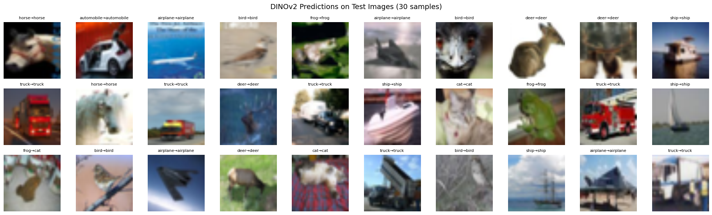

# CIFARbench-Comparative-Analysis-of-CNNs-and-ViTs

MiniVision compares three deep learning architectures—**ResNet-18**, **EfficientNet-B0**, and **DINOv2 (ViT-B/14)**—on **CIFAR-10** and **CIFAR-100** datasets. The project evaluates classification accuracy, efficiency, and transfer learning performance using a unified training and inference pipeline.

## 📊 Final Test Accuracy

| Model           | CIFAR-10 | CIFAR-100 |
|----------------|----------|-----------|
| ResNet-18      | 84.5%    | 58.4%     |
| EfficientNet-B0| 87.3%    | 61.0%     |
| DINOv2-B/14    | 98.7%    | 91.5%     |

---

## 🔧 Features

- 🧠 Model architectures implemented with PyTorch
- 🔁 Transfer learning pipeline from CIFAR-10 to CIFAR-100
- 📈 Confusion matrix and per-class accuracy visualization
- 🧭 UMAP projection of learned features
- 🪄 Single-image inference support

- ---

## 🚀 Quick Start

```bash
git clone https://github.com/HANKSOONG/MiniVision-Lightweight-and-Transformer-Models-for-CIFAR.git
cd MiniVision-Lightweight-and-Transformer-Models-for-CIFAR
pip install -r requirements.txt

- ---
🗂️ Project Structure
MiniVision/
├── notebooks/                  # Training notebooks
├── pipeline/                   # Inference notebooks
├── figures/                    # Confusion matrices, UMAPs, prediction samples
├── requirements.txt
└── README.md

- ---

## 🔍 Sample Predictions with DINOv2

Below is a sample of DINOv2's predictions on CIFAR-10 test images:



---

## 🧬 CIFAR-100 Visualization (DINOv2)

Using UMAP to project model output features into 2D space:


