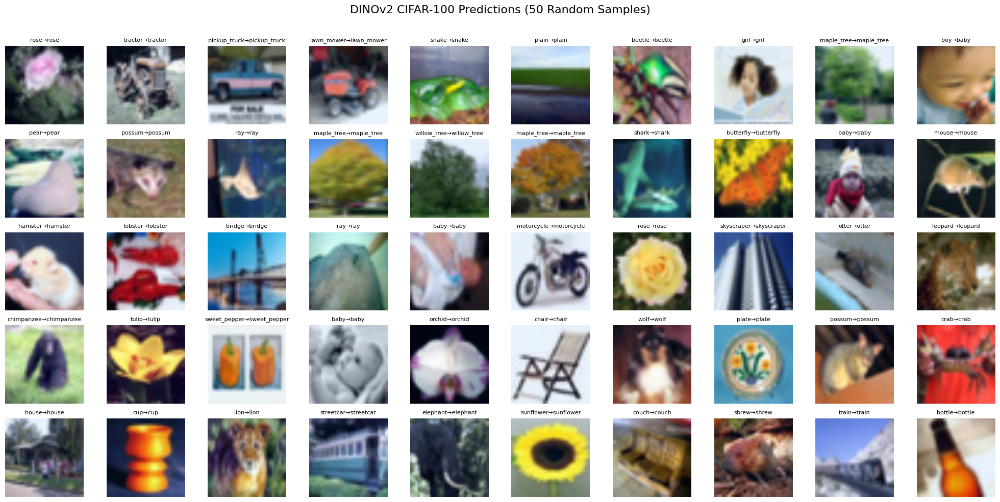

# CIFARbench: Comparative Analysis of CNNs and ViTs

MiniVision compares three deep learning architectures—**ResNet-18**, **EfficientNet-B0**, and **DINOv2 (ViT-B/14)**—on **CIFAR-10** and **CIFAR-100** datasets. The project evaluates classification accuracy, efficiency, and transfer learning performance using a unified training and inference pipeline.

---

## 📈 Final Test Accuracy

| Model           | CIFAR-10 | CIFAR-100 |
| --------------- | -------- | --------- |
| ResNet-18       | 84.5%    | 58.4%     |
| EfficientNet-B0 | 87.3%    | 61.0%     |
| DINOv2-B/14     | 98.7%    | 91.5%     |

---

## 🔧 Features

* 🧠 Model architectures implemented with PyTorch
* 🔁 Transfer learning pipeline from CIFAR-10 to CIFAR-100
* 📈 Confusion matrix and per-class accuracy visualization
* 🗝 UMAP projection of learned features
* 🧪 Single-image inference support

---

## 🚀 Quick Start

```bash
git clone https://github.com/HANKSOONG/MiniVision-Lightweight-and-Transformer-Models-for-CIFAR.git
cd MiniVision-Lightweight-and-Transformer-Models-for-CIFAR
pip install -r requirements.txt
```

---

## 📂 Project Structure

```
MiniVision/
├── notebooks/                  # Training notebooks
├── pipeline/                   # Inference notebooks
├── figures/                    # Confusion matrices, UMAPs, prediction samples
├── requirements.txt
└── README.md
```

---

## 🔍 Sample Predictions with DINOv2

Below is a sample of **DINOv2-B/14**'s predictions on **CIFAR-10** test images:


❤️As you can see, 29 of them are correct, only the back of the frog was misidentified as a cat.


Below is a sample of **DINOv2-B/14**'s predictions on **CIFAR-100** test images(50 samples):



❤️As you can see, 49 of them were correct, only the boy was misidentified as a baby (but he is indeed a **baby boy**)

---

## 🧪 Training Strategy

The models were trained or fine-tuned from ImageNet-pretrained checkpoints using PyTorch.

- **CIFAR-10**: Full training from pretrained backbone with a new classification head.  
- **CIFAR-100**: Transfer learning using frozen backbone (first 9 layers for DINOv2), with fine-tuning on classification head.  
- **Augmentations**: Random crops, horizontal flips, brightness/contrast jitter.  
- **Regularization**: Weight decay, learning rate scheduling (ReduceLROnPlateau), early stopping after 5 no-improve epochs.  
- **Optimizers**: AdamW for ViTs, SGD for CNNs.  
- **Mixed Precision**: Enabled on GPU to accelerate training.

Each model's training progress was tracked using validation accuracy and loss curves.  
You can find these plots under:

figures/training_curves/
...

Plots are useful for understanding convergence behavior, early stopping, and overfitting across different architectures.


---

## 🧪 CIFAR-100 Visualization

For **DinoV2-B/14**, using UMAP to project model output features into 2D space:


And this is UMAP for **ResNet-18**:


and UMAP for **EfficientNet-B0**


It can be seen that ResNet-18 and EfficientNet-B0 are almost not clustered compared to dinov2-B14, which largely reflects their low accuracy in a large number of classification fields (cifar100).
