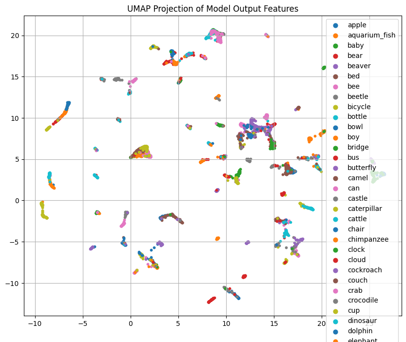
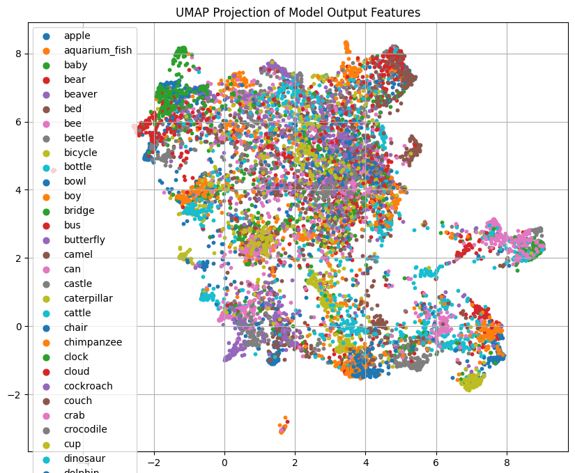
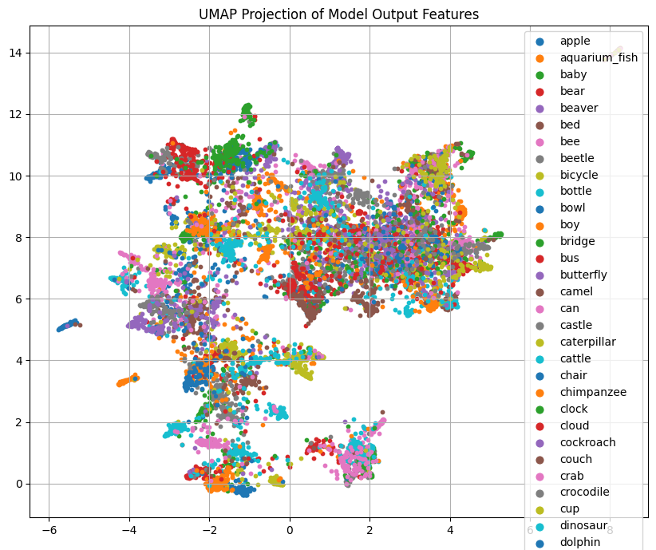

# MiniVision: Benchmarking CNNs and Vision Transformers on CIFAR-10/100

**MiniVision** benchmarks three computer vision architectures — **ResNet-18**, **EfficientNet-B0**, and **DINOv2 (ViT-B/14)** — using a unified PyTorch pipeline for training, evaluation, and feature visualization.

I first trained all models on **CIFAR-10** to establish strong base performance, and then applied **transfer learning** to adapt each model to the more fine-grained **CIFAR-100** dataset. The goal was to assess both raw accuracy and the models' ability to generalize across domains.

---

## 🚀 Highlights

- ✅ Achieved **98.7%** test accuracy on CIFAR-10 and **91.5%** on CIFAR-100 with DINOv2
- 🔁 Applied transfer learning techniques to adapt models from CIFAR-10 to CIFAR-100
- 🧠 Built a modular pipeline for training, evaluation, and visualization using PyTorch
- 📉 Integrated early stopping, learning rate scheduling, and model checkpointing
- 🔍 Visualized model embeddings with UMAP; analyzed per-class accuracy and confusion matrices
- 🖼️ Supported single-image predictions with dynamic model switching

---

## 📊 Results Overview

| Model           | CIFAR-10 | CIFAR-100 |
|----------------|----------|-----------|
| ResNet-18       | 84.5%    | 58.4%     |
| EfficientNet-B0 | 87.3%    | 61.0%     |
| DINOv2-B/14     | 98.7%    | 91.5%     |

All models were fine-tuned from pretrained ImageNet weights and evaluated under consistent conditions.

---

## 🧪 Technical Approach

**Training Workflow:**
- Trained all models on CIFAR-10 first using custom augmentations and early stopping
- Transferred learned weights to CIFAR-100 for fine-tuning
- For DINOv2, froze the first 9 transformer layers to preserve pretrained features

**Optimization:**
- Data Augmentations: random crop, horizontal flip, color jitter
- Optimizers: AdamW for Vision Transformers, SGD for CNNs
- Regularization: weight decay, ReduceLROnPlateau scheduling, early stopping after 5 stagnant epochs
- Mixed precision training enabled for faster GPU performance

**Evaluation:**
- Confusion matrices and per-class accuracy metrics
- UMAP projections of learned feature embeddings
- Cross-dataset comparison to analyze generalization

---

## 🗂️ Project Structure

MiniVision/
├── notebooks/ # Training notebooks
├── pipeline/ # Inference + analysis
├── figures/ # Training curves, UMAPs, prediction samples
├── requirements.txt
└── README.md

yaml
Copy
Edit

---

## 📦 Try It Yourself

```bash
git clone https://github.com/HANKSOONG/MiniVision-Lightweight-and-Transformer-Models-for-CIFAR.git
cd MiniVision-Lightweight-and-Transformer-Models-for-CIFAR
pip install -r requirements.txt
Then open pipeline.ipynb to:

Load any model (ResNet-18 / EfficientNet-B0 / DINOv2)

Run inference on CIFAR-10 or CIFAR-100

Visualize accuracy, confusion matrix, and feature space clustering

---

📸 Sample Output
DINOv2 predictions on CIFAR-10:


❤️As you can see, 29 of them are correct, only the back of the frog was misidentified as a cat.

DINOv2 predictions on CIFAR-100:



❤️As you can see, 49 of them were correct, only the boy was misidentified as a baby (but he is indeed a **baby boy**)

UMAP Embeddings for CIFAR-100:

For **DinoV2-B/14**, using UMAP to project model output features into 2D space:


And this is UMAP for **ResNet-18**:


and UMAP for **EfficientNet-B0**


It can be seen that ResNet-18 and EfficientNet-B0 are almost not clustered compared to dinov2-B14, which largely reflects their low accuracy in a large number of classification fields (cifar100).

---

🔑 Key Takeaways
DINOv2 significantly outperforms CNN baselines in both accuracy and feature clarity

EfficientNet-B0 offers a solid trade-off between accuracy and efficiency

Transfer learning from CIFAR-10 to CIFAR-100 reveals generalization gaps in CNNs
